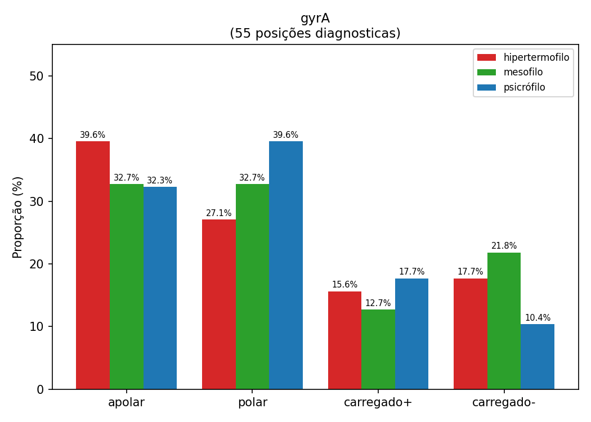
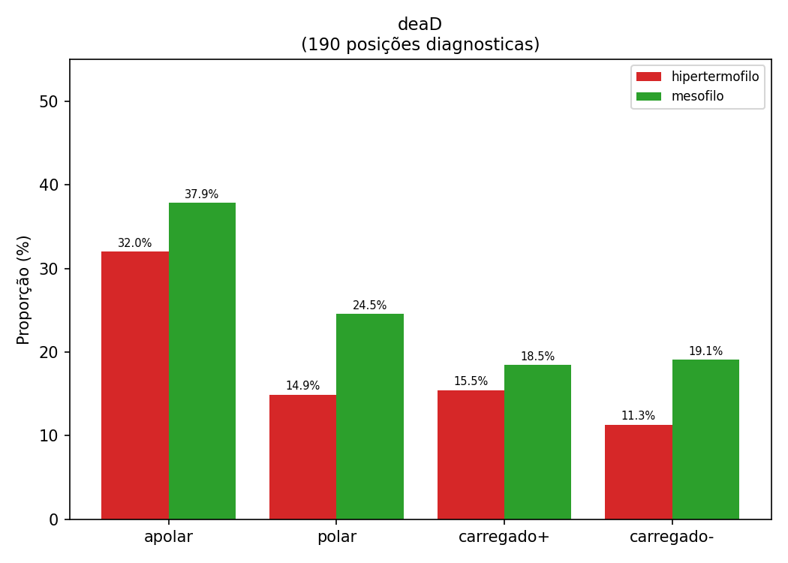

# Metodologia

## Slide 1 — Organismos Utilizados

| Organismo | Domínio | Ambiente | OGT | Accession NCBI |
|-----------|---------|----------|-----|----------------|
| *Thermocrinis ruber* | Bacteria | Hipertermófilo | > 80°C | GCA_000512735.1 |
| *Thermotoga maritima* | Bacteria | Hipertermófilo | > 80°C | GCA_000008545.1 |
| *Pyrococcus furiosus* | Archaea | Hipertermófilo | > 80°C | GCA_000007305.1 |
| *Thermococcus litoralis* | Archaea | Hipertermófilo | > 80°C | GCA_000246985.3 |
| *Escherichia fergusonii* | Bacteria | Mesófilo | 20–45°C | GCA_000026225.1 |
| *Methanococcus maripaludis* | Archaea | Mesófilo | 20–45°C | GCA_002945325.1 |
| *Psychrobacter arcticus* | Bacteria | Psicrófilo | < 20°C | GCA_000012305.1 |
| *Methanococcoides burtonii* | Archaea | Psicrófilo | < 20°C | GCA_000013725.1 |

> Millán Arias P et al. *Environment and taxonomy shape the genomic signature of prokaryotic extremophiles.* Sci Rep. 2023;13:16105.


(obs: a partir daqui seriam os slides específicos da análise de alinhamento, a tabela acima vai ser usada de forma geral por todas as análises)

## Slide 2 - Genes Selecionados

| Gene | KO Number | Função resumida |
|------|-----------|----------------|
| dnaK | K04043 | Chaperona Hsp70: dobramento e estabilização de proteínas no frio |
| groEL | K04077 | Chaperonina: remonta proteínas desnaturadas pelo calor |
| gyrA | K02469 | DNA girase (sub. A): regula superenrolamento do DNA no frio |
| deaD | K05592 | RNA helicase DEAD-box: desfaz estruturas secundárias de RNA no frio |

> Genes selecionados a partir de Verma et al. (2024): dnaK (§ 3.2), gyrA e deaD (§ 3.4), groEL (§ 4.2)


## Slide 3 — Mapeamento KEGG — Presença e Ausência dos Genes

| Organismo | Ambiente | dnaK | groEL | gyrA | deaD |
|-----------|----------|:----:|:-----:|:----:|:----:|
| *T. ruber* | Hipertermófilo | ✓ | ✓ | ✓ | ✓ |
| *T. maritima* | Hipertermófilo | ✓ | ✓ | ✓ | ✗ |
| *P. furiosus* | Hipertermófilo | ✗ | ✗ | ✗ | ✗ |
| *T. litoralis* | Hipertermófilo | ✗ | ✗ | ✗ | ✓ |
| *E. fergusonii* | Mesófilo | ✓ | ✓ | ✓ | ✓ |
| *M. maripaludis* | Mesófilo | ✗ | ✗ | ✗ | ✓ |
| *P. arcticus* | Psicrófilo | ✓ | ✓ | ✓ | ✗ |
| *M. burtonii* | Psicrófilo | ✓ | ✗ | ✓ | ✗ |


## Slide 4 - Organismos em cada Alinhamento

| Gene | Hipertermófilos | Mesófilos | Psicrófìlos | N |
|------|----------------|-----------|-------------|---|
| gyrA | *T. ruber*, *T. maritima* | *E. fergusonii* | *P. arcticus*, *M. burtonii* | 5 |
| dnaK | *T. ruber*, *T. maritima* | *E. fergusonii* | *P. arcticus*, *M. burtonii* | 5 |
| groEL | *T. ruber*, *T. maritima* | *E. fergusonii* | *P. arcticus* | 4 |
| deaD | *T. ruber*, *T. litoralis* | *E. fergusonii*, *M. maripaludis* | — | 4 |

> gyrA, dnaK e groEL cobrem os 3 ambientes térmicos. deaD cobre apenas hipertermófilos e mesófilos.


(obs: se precisar juntar as tabelas de genes selecionados, mapeamento KEGG e organismos em cada alinhamento dos slides acima em um unico slide tudo bem)

## Slide 5 — Fluxo da Metodologia do Alinhamento

```
┌─────────────────────────────────────────────────────────┐
│  1. KEGG Mapping                                        │
│     · Identificação dos KO numbers de cada gene         │
│     · Verificação de presença/ausência em cada          │
│       organismo via kegg.jp                             │                     
└────────────────────────┬────────────────────────────────┘
                         ▼
┌─────────────────────────────────────────────────────────┐
│  2. Download das Sequências (NCBI Protein)              │
│     · Biopython — Entrez.efetch(db="protein")           │
│     · Formato FASTA                                     │ 
└────────────────────────┬────────────────────────────────┘
                         ▼
┌─────────────────────────────────────────────────────────┐
│  3. Alinhamento Múltiplo — MAFFT --auto                 │
│     · Algoritmo: L-INS-i (Smith-Waterman local)         │
│     · Matriz de substituição: BLOSUM62                  │
│     · Saída: 4 arquivos .fasta alinhados                │
└────────────────────────┬────────────────────────────────┘
                         ▼
┌─────────────────────────────────────────────────────────┐
│  4. Análise                                             │
│     · Classificação de posições conservadas vs.         │
│       discriminantes                                    │
│     · Cálculo do perfil químico por grupo ambiental     │
└─────────────────────────────────────────────────────────┘
```


## Slide 6 — Análise das Posições do Alinhamento

### Tipos de posição

| Tipo | Definição | Interpretação biológica |
|------|-----------|------------------------|
| **Conservada** | Mesmo aminoácido em todos os organismos, independente do ambiente | Posição essencial para a função — qualquer mutação seria deletéria |
| **Discriminante** | Cada grupo ambiental tem aminoácidos completamente distintos dos outros grupos | Candidata a refletir adaptação imposta pelo nicho térmico |

### Resumo por gene

| Gene | Total (aa) | Conservadas | % Conservadas | Discriminantes | Grupos ambientais |
|------|:----------:|:-----------:|:-------------:|:--------------:|:-----------------:|
| gyrA | 1019 | 210 | 20,6% | 55 | Hipert. / Mesóf. / Psicrófilo |
| dnaK | 670 | 226 | 33,7% | 32 | Hipert. / Mesóf. / Psicrófilo |
| groEL | 553 | 254 | 45,9% | 46 | Hipert. / Mesóf. / Psicrófilo |
| deaD | 732 | 89 | 12,2% | 190 | Hipert. / Mesóf. |

### Hipótese testada


> Se o ambiente imprime modificações sistemáticas, cada grupo ambiental deve apresentar **perfil químico distinto** nas posições discriminantes, por exemplo, mais aminoácidos **apolares** em hipertermófilos e mais **polares e carregados** em psicrófìlos.

obs: se sobrar espaço dá para colocar os gŕaficos de resultado abaixo nesse mesmo slide (as imagens estao na pasta imagens):

## gyrA



## deaD

